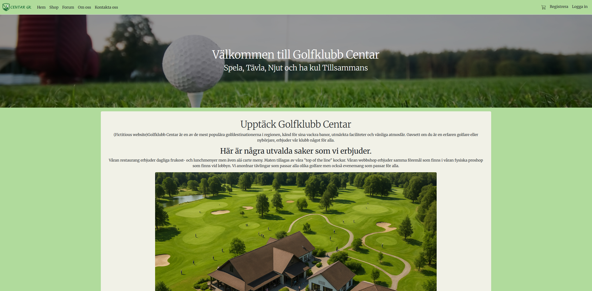
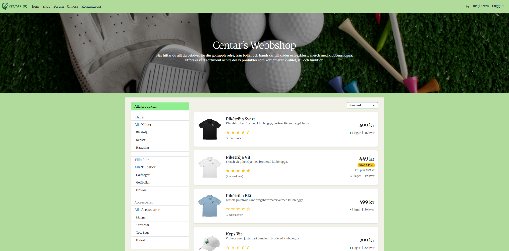
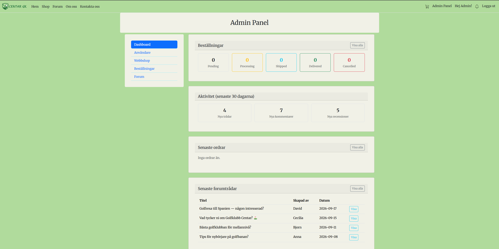
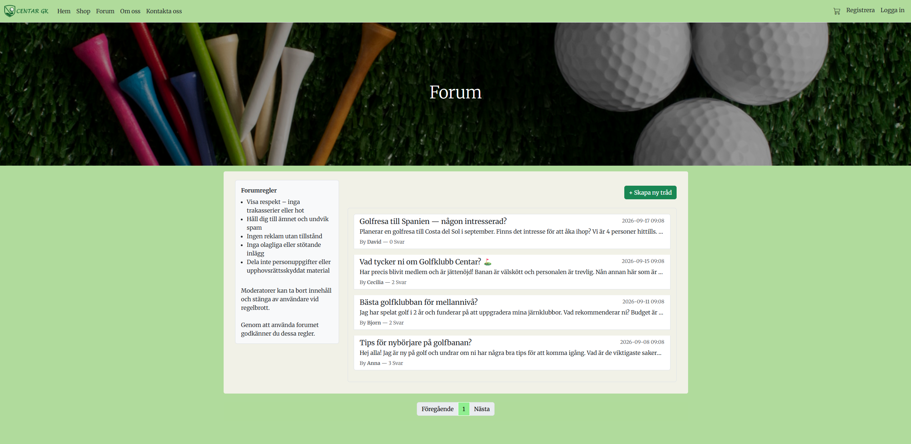
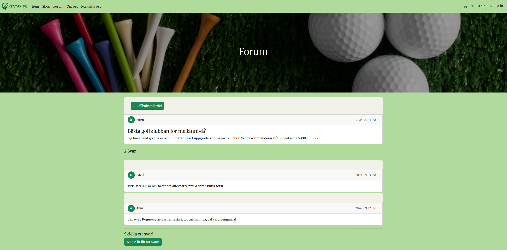
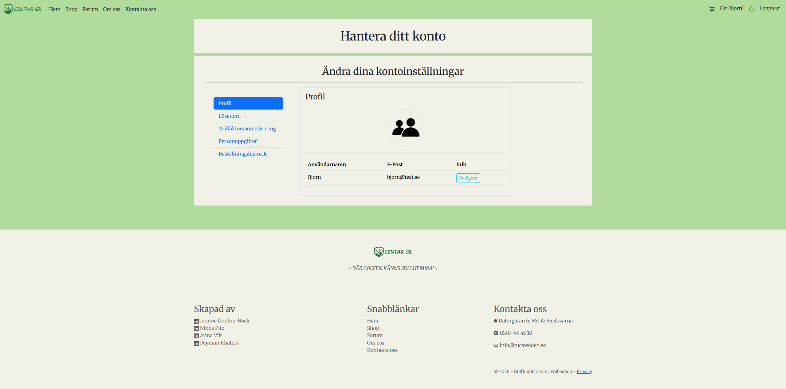

# Golfklubb Centar – Webbshop

Ett skolprojekt utvecklat av ett team om 4 personer. En fullständig webbapplikation för Golfklubb Centar med webbshop, forum, adminpanel och communityfunktioner byggd med ASP.NET Core MVC och Entity Framework Core.

---

## Innehållsförteckning

- [Om projektet](#om-projektet)
- [Teamet](#teamet)
- [Tekniker och verktyg](#tekniker-och-verktyg)
- [Funktionalitet](#funktionalitet)
- [Projektstruktur](#projektstruktur)
- [Databasstruktur](#databasstruktur)
- [Kom igång](#kom-igång)
- [Konfiguration](#konfiguration)
- [Seeddata](#seeddata)
- [Roller och behörigheter](#roller-och-behörigheter)

---

## Om projektet

Golfklubb Centar Webbshop är en webbaserad plattform för en golfklubb där medlemmar kan handla golfprodukter, delta i ett community-forum, följa andra användare och få notifikationer om aktiviteter. Administratörer har tillgång till en komplett adminpanel för att hantera användare, produkter, kategorier, rabatter och beställningar.

---

## Teamet

| Namn   | Roll                    |
| ------ | ----------------------- |
| Anna   | Utvecklare              |
| Jerome | Scrum Master/Utvecklare |
| Ninos  | Utvecklare              |
| Peyman | Utvecklare              |

---

## Tekniker och verktyg

- **Framework:** ASP.NET Core MVC (.NET 9)
- **ORM:** Entity Framework Core 9
- **Databas:** Microsoft SQL Server / LocalDB
- **Autentisering:** ASP.NET Core Identity
- **Frontend:** Bootstrap 5, CSS, JavaScript
- **Versionshantering:** Git / GitHub
- **Projekthantering:** Jira
- **IDE:** Visual Studio 2022

### NuGet-paket

| Paket                                             | Version |
| ------------------------------------------------- | ------- |
| Microsoft.AspNetCore.Identity.EntityFrameworkCore | 9.0.12  |
| Microsoft.AspNetCore.Identity.UI                  | 9.0.12  |
| Microsoft.EntityFrameworkCore.SqlServer           | 9.0.12  |
| Microsoft.EntityFrameworkCore.Tools               | 9.0.12  |
| Microsoft.VisualStudio.Web.CodeGeneration.Design  | 9.0.12  |

---

## Funktionalitet

### Webbshop

- Produktkatalog med bilder, beskrivningar och priser
- Filtrering per kategori (huvud- och underkategorier)
- Sortering av produkter
- Paginering
- Produktdetaljer med recensioner och betyg
- Varukorg (session-baserad)
- Checkout med leveransinformation
- Orderbekräftelse
- Rabattsystem kopplat till produkter

### Användarkonto (Identity)

- Registrering och inloggning
- Redigera profil (namn, användarnamn, email, telefon)
- Ladda upp profilbild
- Byta lösenord
- Orderhistorik med kvitton
- Publik profilsida

### Community – Forum

- Lista och bläddra bland trådar
- Skapa nya forumtrådar
- Kommentera på trådar
- Radera egna inlägg och kommentarer
- Forumblockering (blockerade användare kan inte posta/kommentera)

### Följ-system och notifikationer

- Följa och avfölja andra användare
- Lista över vem man följer och vem som följer en
- Bell-ikon i navbar med räknare för olästa notifikationer (uppdateras var 30:e sekund)
- Notifikationer för:
  - Ny följare
  - Ny forumtråd från en följd användare
  - Ny kommentar på en tråd man skapat eller deltagit i
  - Admin har raderat ens inlägg eller kommentar
  - Orderstatus har ändrats

### Adminpanel

Tillgänglig via `/Admin` för användare med rollen Admin.

**Dashboard**

- Counters för orderstatus (Ny Order, Packas, Skickad, Levererad, Avbruten)
- Aktivitetsöversikt för senaste 30 dagarna (nya trådar, kommentarer, recensioner)
- Senaste ordrar och forumtrådar

**Användarhantering**

- Lista alla användare
- Visa användardetaljer
- Redigera användaruppgifter (namn, email, användarnamn, telefon, roller)
- Radera och ladda upp profilbild
- Blockera/avblockera användare från forumet
- Radera användare
- Visa användarens orderhistorik
- Visa användarens forumhistorik

**Webbshop-administration**

- CRUD för produkter (inkl. bilduppladdning och lagerhantering)
- CRUD för kategorier (med stöd för föräldrakategorier)
- CRUD för rabatter

**Orderhantering**

- Lista alla inkommande beställningar
- Visa orderdetaljer
- Uppdatera orderstatus (Ny Order → Packas → Skickad → Levererad / Avbruten)

---
## Screenshots

### Startsida

### Webbshop

### Produktdetaljer

### Adminpanel

### Forum

### Inlägg

### Användarprofil


---

## Projektstruktur

```
Golfklubb-Centar-Webbshop/
├── Areas/
│   └── Identity/
│       ├── Data/
│       │   ├── ApplicationDbContext.cs
│       │   ├── ApplicationUser.cs
│       │   └── SeedData.cs
│       └── Pages/
│           └── Account/
│               └── Manage/         ← Användarprofil, orderhistorik, kvitto
├── Controllers/
│   ├── AdminCategoryController.cs
│   ├── AdminController.cs          ← Dashboard + Webshop-landingpage
│   ├── AdminDiscountController.cs
│   ├── AdminOrderController.cs
│   ├── AdminProductController.cs
│   ├── AdminUserController.cs
│   ├── CartController.cs
│   ├── FollowController.cs
│   ├── ForumController.cs
│   ├── HomeController.cs
│   ├── NotificationController.cs
│   ├── UserController.cs           ← Publika användarprofiler
│   └── WebshopController.cs
├── Models/
│   ├── CartItem.cs                 ← Session-modell (ingen DB-tabell)
│   ├── Category.cs
│   ├── Comment.cs
│   ├── Discount.cs
│   ├── Follow.cs
│   ├── History.cs
│   ├── Invoice.cs
│   ├── InvoiceItem.cs
│   ├── Notification.cs
│   ├── Order.cs
│   ├── OrderItem.cs
│   ├── Payment.cs
│   ├── Post.cs
│   ├── Product.cs
│   ├── ProductReview.cs
│   ├── ReviewReply.cs
│   ├── Stock.cs
│   ├── Taxis.cs
│   └── ViewModels/                 ← Alla ViewModels
├── Views/
│   ├── Admin/
│   ├── AdminCategory/
│   ├── AdminDiscount/
│   ├── AdminOrder/
│   ├── AdminProduct/
│   ├── AdminUser/
│   ├── Cart/
│   ├── Follow/
│   ├── Forum/
│   ├── Home/
│   ├── Notification/
│   ├── Shared/
│   ├── User/
│   └── Webshop/
├── wwwroot/
│   ├── css/
│   ├── images/
│   └── js/
├── Migrations/
├── Program.cs
├── appsettings.Example.json        ← Mall för konfiguration
└── appsettings.json                ← Ignoreras av git, skapas lokalt
```

---

## Databasstruktur

Databasen är uppdelad i fyra scheman:

| Schema              | Tabeller                                                                                        |
| ------------------- | ----------------------------------------------------------------------------------------------- |
| `CentarUserMngt`    | Users, Roles, UserRoles, UserClaims, UserLogin, UserTokens, RoleClaims, Follows, Notifications  |
| `CentarProductMngt` | Products, Categories, Discounts, Stocks, ProductReviews, ReviewReplies                          |
| `CentarOrderMngt`   | Orders, OrderItems, Invoices, InvoiceItems, Histories, Payments, Taxes                          |
| `CentarForumMngt`   | Posts, Comments                                                                                 |

### Varukorg

Varukorgen är session-baserad och sparas inte i databasen under shoppingprocessen. Vid checkout skapas `Order` → `OrderItems` direkt i databasen.

Databasen är förberedd med Invoices, InvoiceItems, Payment, Taxes och History.

---

## Kom igång

### Krav

- Visual Studio 2022 eller senare
- .NET 9 SDK
- SQL Server LocalDB (ingår i Visual Studio)

### Installation

1. Klona repot:

```bash
git clone https://github.com/Bockarns/Golfklubb-Centar-Webbshop.git
```

2. Öppna `Golfklubb-Centar-Webbshop.slnx` i Visual Studio.

3. Kopiera `appsettings.Example.json` och döp om kopian till `appsettings.json`:

```bash
copy appsettings.Example.json appsettings.json
```

4. Kör migrationer i Package Manager Console:

```
Update-Database
```

5. Kör projektet med `F5` — seeddata skapas automatiskt vid första start.

### Testkonton (skapas automatiskt vid första start)

| Email            | Lösenord | Roll  |
| ---------------- | -------- | ----- |
| admin@test.se    | Test123! | Admin |
| anna@test.se     | Test123! | User  |
| bjorn@test.se    | Test123! | User  |
| cecilia@test.se  | Test123! | User  |
| david@test.se    | Test123! | User  |

---

## Konfiguration

Connection string konfigureras i `appsettings.json`. Filen skapas genom att kopiera `appsettings.Example.json`:

```json
{
  "ConnectionStrings": {
    "ApplicationDbContextConnection": "Server=(localdb)\\mssqllocaldb;Database=GolfklubbCentar;Trusted_Connection=True;MultipleActiveResultSets=true"
  }
}
```

> **OBS:** `appsettings.json` är ignorerad av git och ska aldrig commitas. Lägg aldrig in känslig information som lösenord direkt i filen i ett produktionsprojekt. Använd miljövariabler eller Azure Key Vault.

### Sessions

Sessions är konfigurerade med 30 minuters timeout och används för varukorgen.

---

## Seeddata

`SeedData.cs` innehåller metoder för att sätta upp grunddata som körs automatiskt vid första start:

| Metod          | Beskrivning                                                              |
| -------------- | ------------------------------------------------------------------------ |
| `SeedAll`      | Huvudmetod som kör alla seed-metoder i rätt ordning                      |
| `SeedRoles`    | Skapar rollerna `Admin` och `User`, samt ett standardadminkonto          |
| `SeedUsers`    | Skapar fyra testanvändare med rollen User                                |
| `SeedTax`      | Skapar standard-moms (25%) för fakturor                                  |
| `SeedDiscount` | Skapar grundläggande rabatter (Ordinarie Pris, StartRea 10%, Sommarrea 20%) |
| `SeedCategory` | Skapar kategorier med huvud- och underkategorier                         |
| `SeedProduct`  | Skapar 11 exempelprodukter kopplade till kategorier och rabatter         |
| `SeedStock`    | Skapar lagerposterna för alla produkter                                  |
| `SeedForum`    | Skapar forumtrådar och kommentarer                                       |
| `SeedReviews`  | Skapar produktrecensioner                                                |

---

## Roller och behörigheter

| Roll            | Behörigheter                                                                                              |
| --------------- | --------------------------------------------------------------------------------------------------------- |
| **Admin**       | Full tillgång till adminpanelen, kan hantera användare, produkter, kategorier, rabatter och beställningar |
| **User**        | Kan handla, delta i forum, följa användare, skriva recensioner och hantera sin profil                     |
| **Ej inloggad** | Kan bläddra i webbshopen och läsa forumtrådar                                                             |

---

## Migreringshistorik

| Migration                                   | Beskrivning                                     |
| ------------------------------------------- | ----------------------------------------------- |
| Initial                                     | Grundläggande tabellstruktur                    |
| UpdateSchemaNameAndTableNames               | Uppdaterade schemanamn                          |
| AdditionTablesAndRelationsToApplicationUser | Lade till relationer till ApplicationUser       |
| AddForumBanAndProfileImagePathToUser        | IsForumBanned och ProfileImagePath på användare |
| CreatedAtForReview                          | Datum på recensioner                            |
| DroppedCartTablesAndAddedNewPropToOrder     | Session-baserad varukorg, nya orderfält         |
| OrderItemModelAndFullNameToOrder            | OrderItem-modell och FullName på Order          |
| DatePropForOrder                            | StatusDate på Order                             |
| AddedReviewReplyModel                       | Svar på recensioner                             |
| AddFollowAndNotifications                   | Följ-system och notifikationer                  |
| AddLinkToNotification                       | Klickbara notifikationslänkar                   |
| UpdateForumColumnsToUnicode                 | Unicode-stöd för emojis i forum                 |
| CityAndCountryAddedToApplicationUser        | Stad och land på användarprofil                 |
